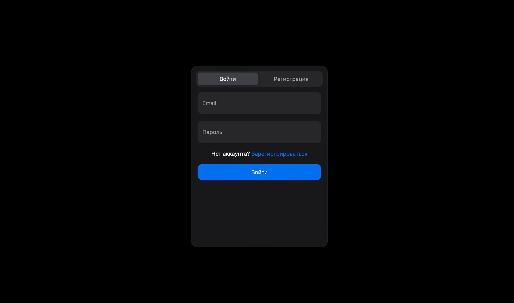
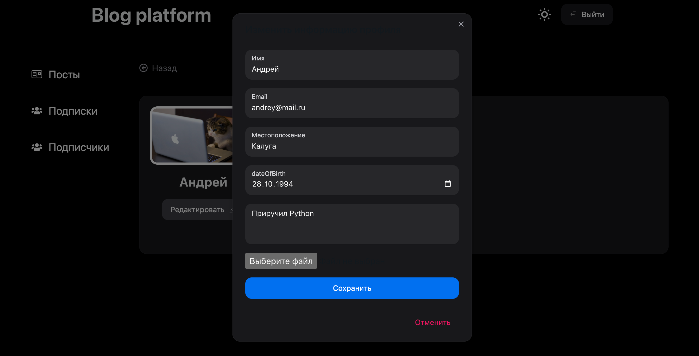
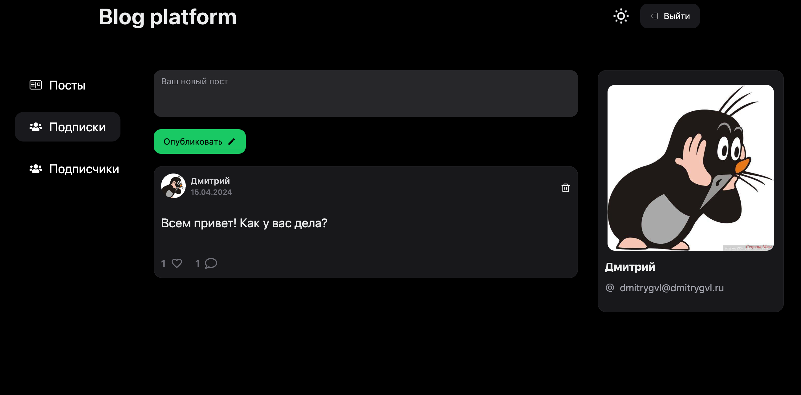
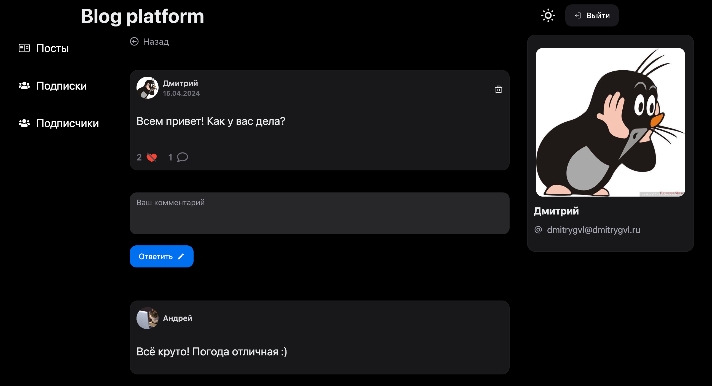
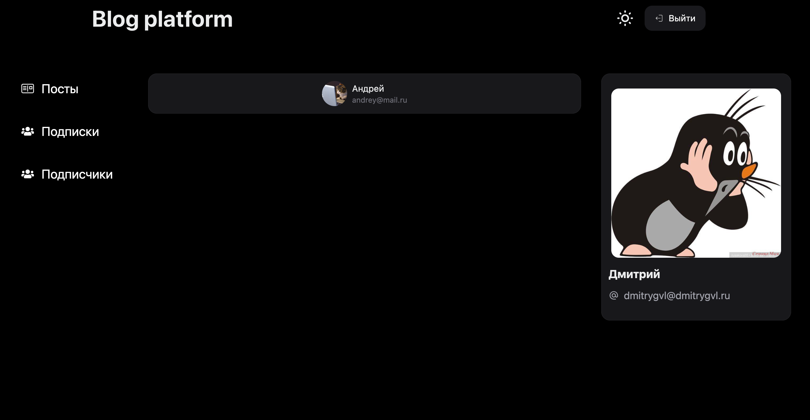
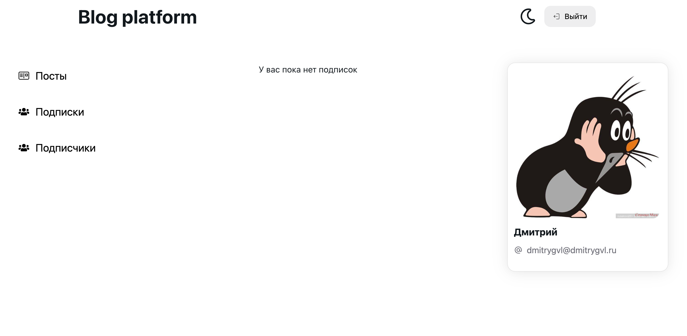

<div align="center">
  <h1><code>blog platform client</code></h1>

<strong>This is the client of a fullstack blog-platform-app</strong>
<br/>
<strong>**[blog-platform-API is here](https://github.com/dmitrygvl/blog-platform-API)**</strong>

  <p>
  <a href=""></a>
    
  </p>

_**[Deployed here](http://158.160.161.140/)**_

## </div>

## Table of Contents

- [About](#about)
  - [Built with](#built-with)
  - [Pages](#pages)
- [Getting Started](#getting-started)
  - [Prerequisites](#prerequisites)
  - [Installing](#installing)
- [License](#license)

## About <a name="about"></a>

This is a client app created using TypeScript, React, NextUI, Redux Toolkit and Tailwind. [blog-platform-API is here](https://github.com/dmitrygvl/blog-platform-API).

- Themes: dark and light.
- Likes: add and remove likes.
- Subscription: follow and unfollow users.
- User profile: upload your pic for avatar, change email, add your location and description of your profile.
- JWT authentication.
- Forms: forms validation using react-hook-dorm.
- Dockerfile configuration.

### Built with <a name="built-with"></a>

<p align="center"><a href="https://www.typescriptlang.org/" target="_blank"> 
     </a> 
    <a href="https://react.dev/" target="_blank"> 
   </a> <a href="https://redux-toolkit.js.org/" target="_blank"> 
   </a> <a href="https://tailwindcss.com/" target="_blank"> 
  <a href="https://eslint.org/" target="_blank"> 
   </a>
   </a> <a href="https://www.docker.com/" target="_blank"> 
   </a> <a href="https://vitejs.dev/" target="_blank"> 
   </a>
</p>

### Pages: <a name="pages"></a>

<h5>Authorization</h5>

<h5>User profile</h5>

<h5>Posts</h5>

<h5>Current post</h5>

<h5>Followers</h5>

<h5>Following</h5>


## Getting started <a name="getting-started"></a>

### Prerequisites <a name="prerequisites"></a>

:warning: Before installing the project latest version of **npm** should be installed.

```
npm install -g npm@latest
```

:warning: You will also need Docker. It can be installed from the [official Docker website](https://www.docker.com/products/docker-desktop/).

### Installing <a name="installing"></a>

1. Clone the repo with API:

```
git clone https://github.com/dmitrygvl/blog-platform-API.git
```

2. Clone the repo with client app:

```
git clone https://github.com/dmitrygvl/blog-platform-client.git
```

3. Open a terminal (or command line) and go to the root directory of the server:

```
cd blog-platform-API
```

4. Rename the .env.local file to .env:

```
mv .env.sample .env
```

5. Rename the env.local file to env:

```
mv .env.sample .env
```

6. Set your secret key in the env file. it can be any string:

```
SECRET_KEY='YOUR_SECRET_KEY'
```

7. Run the docker build command. The blog-platform-API and blog-platform-client folders must be in the same directory:

```
docker compose up
```

8. Open your browser and go to http://localhost:80 to see the running project.

## License <a name="license"></a>

[![MIT License][license-shield]][license-url]

[license-url]: https://github.com/othneildrew/Best-README-Template/blob/master/LICENSE.txt
[license-shield]: https://img.shields.io/github/license/othneildrew/Best-README-Template.svg?style=for-the-badge
